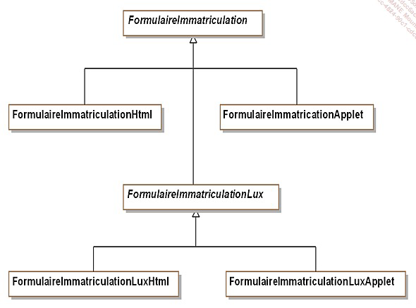

# .net_Theo

## Design Patterns ou patterns de conception 

 ## Description des patterns

- nom 
- description
- exemple de code sous forme de diagramme UML
- la structure standard ( abstraite )
- un exemple de code 

## Cas concret d'etude pour ce cours

Nous allons prendre en exemple le cas d'une societe qui vend des vehicules en ligne. 

## Premiere grande famille de design pattern : les patterns de construction

Simplifier la création d'objet, qui devient abstraite, la standardiser .
On favorise l'utilisation d'interface entre les objets.

Exemple de patterns : singleton.
Le but est de cacher la création d'objet.    

### Le Pattern Abstract Factory

Le but de ce pattern est de permettre de fabriquer des objets regoupes en "famille" sans avoir a connaitre les classes cilbles destinee a  la fabrication de ces objets.

### Le Pattern Builder

Ce pattern permet d'abstraire la construction d'objets complexes de leur implementation de sorte qu'un client puisse creer des objets complexes sans avoir a se preocuper des differences d'implementation.

Pattern Factory Method
definition  : Introduire une methode abstraite de creation d'objet en reprtant la aux sous-classes concretes de creation effective 
nom du projet : FactoryBuilder
example de UML : 

relation du UML avec le pattern :
description : Une methode basic pour les parents de transmettre leur attribut a leur enfants

Pattern Singleton
definition  : Il faut s'assurer de deux choses lorsqu'on veut mettre en place ce pattern :
une classe ne doit posseder qu'une seule instance
il faut fournir une methode de classe qui permet de fournir cette instance unique
nom du projet : Sigleton
utilisation : quand on a besoin qune classe a une seul instance dans tout le code , ca peut etre bien pour exaple des liens avec des base de donnees

Pattern Prototype
definition: le but dde ce pattern est de creer de nouveau objets en dupliquant ddes objets existants appeler "prototypes" Ces derniers disposent d'une capacite de clonage .
nom du projet : Prototype
example de UML : 

relation du UML avec le pattern :
description :

Deuxieme Famille : Pattern de structuration
Definition prof : L’objectif des patterns de structuration est de faciliter l’indépendance de l’interface d’un objet ou d’un ensemble d’objets vis-à-vis de son implantation. 

Pattern Adapter
definition: le but ici est d'adapter l'interface d'une classe donne afin qu'elle puissent interagir avec un client
nom du projet : Prototype
example de UML : 

relation du UML avec le pattern :
description :
utilisation :

### Le pattern Decorator 
Ici, on cherche à ajouter des fonctionnalites supp a un objet en prenant soin de ne pas modifier son interface. Toutes modifications apportees par ce pattern seront transparentes vis-a-vis des clients

Ce pattern constitue une alternative a la creation de sous classe pour enrichir les fonctionnalites d'un objet.

Le pattern Decorator peut etre utilise dans les domaines suivants :
- notre application souhaite ajouter dynamiquement des fonctionnalites a un objet sans modifier son interface autrement dit sans avoir a modifier les clients de cet objet
- une application doit gerer des fonctionnalites qui peuvent etre retirees dynamiquement.
- l'utilisation de l'heritage n'est pas une option car la hierarchie d'objets est deja trop complexe. 

### Le pattern Bridge

### Le pattern Composite

